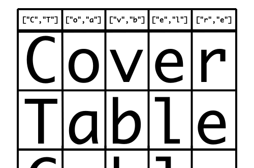

# CoverTable



CoverTable is a **pairwise (N-wise) test case generation library** based on the AETG algorithm, available for both TypeScript and Python.

It is **PICT-compatible**: you can use PICT-format model files — including parameters, sub-models, constraints, invalid values, weights, and aliases — directly with CoverTable.

Try the online demo: **[Compatible PICT](https://covertable.walkframe.com/tools/pict)** — an interactive tool that parses PICT models and generates covering arrays in your browser.

Prefer your editor? Install the **[VS Code extension](https://marketplace.visualstudio.com/items?itemName=walkframe.pict-covertable)** for PICT syntax highlighting, live diagnostics, and one-click covering-array generation.

## Algorithm

CoverTable uses a **one-test-at-a-time greedy algorithm** to generate covering arrays.

1. Assigns a unique serial ID to each factor value, then enumerates all n-way combinations to be covered.
2. For each test row, the **criterion** selects the most efficient uncovered combination to include next by evaluating how many other uncovered combinations it would simultaneously satisfy.
3. Repeats until all combinations are covered.

Two criteria are available:

- **Greedy** (default): Evaluates coverage efficiency for candidate pairs and selects the one that maximizes coverage. The `tolerance` parameter allows trading quality for speed.
- **Simple**: Picks the first feasible pair without efficiency evaluation. Faster, but produces more test cases.

Additionally, **sorters** (Hash / Random) control the initial ordering of combinations, which influences the quality and reproducibility of the output.

See also: [Pairwise Testing Tool Comparison](https://www.pairwise.org/efficiency.html)

## Implementations

CoverTable is available in two implementations, with TypeScript as the primary focus and Python offered as a secondary option.

### TypeScript

[](https://badge.fury.io/js/covertable) [](https://github.com/walkframe/covertable/actions/workflows/typescript.yaml)

Works in both **Node.js** and **browsers** (ESM/CJS dual build).

- [README](https://github.com/walkframe/covertable/blob/master/typescript/README.md)

### Python

[](https://badge.fury.io/py/covertable) [](https://github.com/walkframe/covertable/actions/workflows/python.yaml)

- [README](https://github.com/walkframe/covertable/blob/master/python/README.rst)

### VS Code Extension

[](https://marketplace.visualstudio.com/items?itemName=walkframe.pict-covertable) [](https://open-vsx.org/extension/walkframe/pict-covertable)

**PICT Pairwise Testing with CoverTable** brings PICT support into your editor, powered by the same CoverTable engine — no external binary required.

- **Syntax highlighting** for `.pict` files (parameters, values, weights, negatives, aliases, references, sub-models, and the constraint language).
- **Live diagnostics** for parse errors, with line numbers.
- **Generate Covering Array** — run the model and write the result as a TSV/CSV file next to it, with a status-bar footer (strength / criterion / sorter / case) and a cancellable progress indicator.

Install from the [VS Code Marketplace](https://marketplace.visualstudio.com/items?itemName=walkframe.pict-covertable) / [Open VSX](https://open-vsx.org/extension/walkframe/pict-covertable), or run `code --install-extension walkframe.pict-covertable`.

- [README](https://github.com/walkframe/covertable/blob/master/editors/vscode/README.md)


## Documentation

- **Latest (v3)**: https://covertable.walkframe.com
- **v2 and earlier**: https://docs.walkframe.com/covertable/advanced

## Performance

> **Note:**
> Measured on an **Apple M4 Mac** with **bun (JavaScriptCore)**, coverage `2`.
> **`default`** = a single greedy `make`. **`random best`** = the smallest over a
> random best-of-N search (greedy, except `2^100` which needs the `simple`
> criterion). **`greedy + Optimize`** = the `default` array fed through
> `optimize`, shown as the **total** wall-clock time (greedy `make` + `optimize`)
> as `single-thread / optimizeParallel(8 workers)`. Full results with
> independent verification are in
> [`evidence/VERIFICATION.md`](./evidence/VERIFICATION.md); reproduction and
> verification code lives in [`evidence/repro/`](./evidence/repro/).

| Combination | default | random best | greedy&nbsp;+&nbsp;optimize |
|---|---|---|---|
| **3^4** | `13` (0.008s) | `9` (0.001s) | `9` (<1s / <1s) |
| **3^13** | `19` (0.006s) | `17` (0.005s) | `15` (<1s / <1s) |
| **2^100** | `15` (3.7s) | `12` (3.6s) | `10` (~3.7s / ~3.7s) |
| **4^15 + 3^17 + 2^29** | `36` (1.1s) | `34` (1.0s) | `28` (~26s / ~9s) |
| **4^1 + 3^39 + 2^35** | `27` (2.0s) | `26` (2.0s) | `20` (~106s / ~11s) |
| **10^20** | `197` (1.6s) | `195` (1.6s) | `187` (~54s / ~38s) <br> `183` (~1167s / ~403s) |

In general, as the number of elements or coverage increases, the number of combinations tends to increase significantly.

## Optimize (SA post-process)

`Controller.optimize()` shrinks a greedy array further with simulated annealing.
It is an anytime process — it returns the smallest array found within `budgetMs`
— and every result is independently verified to still cover all required tuples
(see the **`greedy + optimize`** column in the [Performance](#performance) table
above). It reads `strength`/`constraints`/`comparer` from the Controller, so
those can never drift out of sync with the `make` run:

```ts
import { Controller } from "covertable";

const ctrl = new Controller(factors, { strength: 2, /* constraints, ... */ });
const rows = ctrl.make();
const smaller = ctrl.optimize(rows, { budgetMs: 60_000 });          // single-thread
// const smaller = await ctrl.optimizeParallel(rows, { budgetMs: 60_000, workers: 8 });
```

The easy cases collapse to their target in well under a second on one core; only
`10^20` and `4^1 + 3^39 + 2^35` have an expensive endgame, where the cost of
removing each further row grows roughly geometrically as the array approaches its
minimum.

### Multi-core (`optimizeParallel`)

`ctrl.optimizeParallel(rows, { workers: N })` runs `N` cooperating workers and
keeps the smallest verified result. The workers are a
**cooperative island model**: each gets a distinct seed *and* a different move
strategy (plain moves, min-collateral moves, a couple of targeting ratios), and
they **share a global-best array** — a worker that falls behind and stalls adopts
the shared best and joins the frontier, while a couple of scouts keep exploring.
Since the endgame is high-variance, this reliably surfaces a lucky-fast
trajectory:

| Combination | 1 core | 8 workers |
|---|---|---|
| **4^1 + 3^39 + 2^35** | `20` in ~104s | `20` in **~9s** (≈12×) |
| **10^20** | `183` in ~1200s | `183` in **~400s** (≈3×) |

The gain is **variance / robustness**, not a smaller array: the per-row cost
grows geometrically near the optimum, so more workers buy a faster, more
reproducible path to a given size — they do not push past the combinatorial wall
(`4^1 + 3^39 + 2^35` stays at `20`, `10^20` at `183`, on both). See
[Optimize (SA)](https://covertable.walkframe.com/development/optimize) for the
algorithm and parallelization details.

## Tolerance

If you use the `greedy` criterion and specify a positive integer for the `tolerance` option, you can increase speed at the expense of the number of combinations.

The greater the `tolerance`, the faster the speed and the larger the number of combinations.

### Example: 10^20 Test Cases

| Tolerance | num  | time   |
|-----------|------|--------|
| 0 (default) | `195` | `14.48s` |
| 1         | `199` | `12.45s` |
| 2         | `201` | `9.48s`  |
| 3         | `201` | `7.17s`  |
| 4         | `207` | `5.70s`  |
| 5         | `212` | `4.58s`  |
| 6         | `212` | `3.65s`  |
| 7         | `216` | `3.07s`  |
| 8         | `223` | `2.57s`  |
| 9         | `226` | `2.14s`  |
| 10        | `233` | `1.84s`  |
| 11        | `237` | `1.61s`  |
| 12        | `243` | `1.43s`  |
| 13        | `249` | `1.28s`  |
| 14        | `254` | `1.19s`  |


