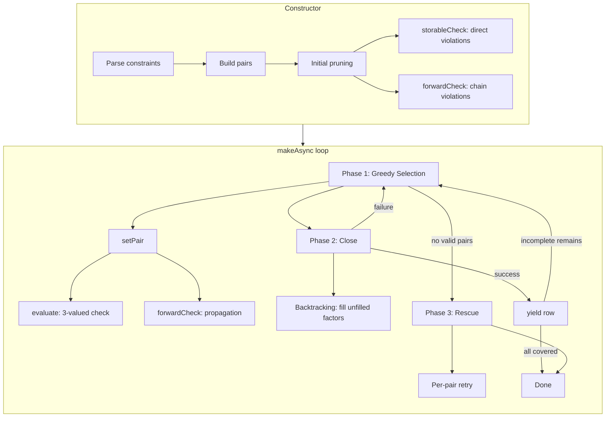
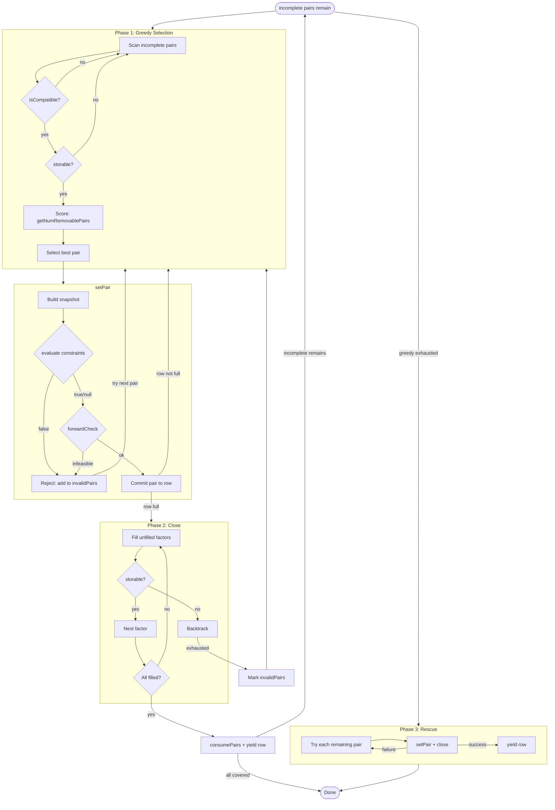

# Constraint Logic

covertable v3 introduces declarative constraints with three-valued (Kleene) logic and forward checking.
This page explains how constraints are evaluated, propagated, and how coverage is guaranteed.

## Overview



## Three-Valued Evaluation

Constraints are evaluated under **Kleene three-valued logic**.
When a referenced factor is not yet assigned in the row, the result is `null` rather than `false`.

| A | B | A AND B | A OR B | NOT A |
|---|---|---------|--------|-------|
| true | true | true | true | false |
| true | false | false | true | false |
| true | null | null | true | null |
| false | true | false | true | true |
| false | false | false | false | true |
| false | null | false | null | true |
| null | true | null | true | null |
| null | false | false | null | null |
| null | null | null | null | null |

This allows the engine to **reject early** when a constraint is definitively violated,
while **deferring** judgment when information is incomplete.

```typescript
// Example: IF [Region] = "EU" THEN [Currency] IN {"EUR", "GBP"}
// Expressed as:
{ operator: 'or', conditions: [
  { operator: 'ne', field: 'Region', value: 'EU' },
  { operator: 'in', field: 'Currency', values: ['EUR', 'GBP'] },
]}

// Row = { Region: "EU" }           → null  (Currency not set)
// Row = { Region: "EU", Currency: "USD" } → false   (rejected)
// Row = { Region: "EU", Currency: "EUR" } → true    (accepted)
// Row = { Region: "US" }           → true    (Region ≠ EU)
```

## Initial Pruning

Before generation begins, the constructor removes pairs from `incomplete` that can never satisfy constraints.

**Two-pass pruning:**

| Pass | Method | Detects |
|------|--------|---------|
| 1 | `storableCheck` | Direct violations — the pair's 2 values alone make a constraint `false` |
| 2 | `forwardCheck` | Chain violations — constraint propagation reveals an empty domain for some factor |

```
Example: 53 constraints, 3849 total pairs
  ├─ storableCheck removes pairs like (Region=JP, Currency=USD)
  │   → IF Region=JP THEN Currency IN {JPY} → false
  │
  └─ forwardCheck removes pairs like (Language=de, Currency=USD)
      → Language=de → Region=EU → Currency ∈ {EUR,GBP} → USD impossible
      → 403 pairs pruned, 3446 feasible pairs remain
```

## Forward Check (Constraint Propagation)

When a value is added to a row, `forwardCheck` determines whether remaining factors
can still be filled without violating constraints.

### Algorithm

```
Input: snapshot (row + new pair)

1. Build domains: for each unfilled factor, domain = all its values
2. Repeat until no change:
   a. For each unfilled factor F:
      - Try each value v in F's domain
      - Set F=v in tempRow, evaluate F's constraints
      - If any constraint → false, remove v from domain
      - If domain is empty → return false (infeasible)
      - If domain shrinks to 1 value → fix it in tempRow, propagate
   b. For multi-value domains, check peer factors:
      - For each peer P, compute union of P's surviving values
        across all candidates of F
      - Narrow P's domain to that union
3. Return true (no contradiction found)
```

### Propagation Example

Given constraints:
- C1: `IF [Language] = "de" THEN [Region] = "EU"`
- C2: `IF [Region] = "EU" THEN [Currency] IN {"EUR", "GBP"}`

When `setPair(Language=de)` is called, the snapshot is `{ Language: "de" }`.

**Round 1** — Region (constraint C1: Language=de requires Region=EU)

| Candidate | C1 result | Survives |
|-----------|-----------|----------|
| Region=EU | true | Yes |
| Region=NA | false | No |
| Region=AP | false | No |
| Region=SA | false | No |

Region narrows to `{EU}` (1 value) → fixed in tempRow, triggers re-propagation.

**Round 2** — Currency (constraint C2: Region=EU requires Currency in `{EUR, GBP}`)

| Candidate | C2 result | Survives |
|-----------|-----------|----------|
| Currency=EUR | true | Yes |
| Currency=USD | false | No |
| Currency=GBP | true | Yes |
| Currency=JPY | false | No |

Currency narrows to `{EUR, GBP}`.

**Round 3** — No domain changes → done, return `true`.

### Peer Propagation

When a domain remains multi-valued (e.g. B = `{10, 20}`), standard propagation stops
because B is not fixed in tempRow. Peer propagation extends this by checking what
each candidate of B forces on other factors.

Given constraints:
- C1: `A=1 → B IN {10, 20}`
- C2: `B=10 → C=100`
- C3: `B=20 → C=200`

Snapshot = `{ A=1, C=300 }`. After standard propagation, B = `{10, 20}` (not fixed).

**Peer check: what does each B candidate allow for C?**

| B candidate | C surviving values |
|-------------|-------------------|
| B=10 | `{100}` |
| B=20 | `{200}` |
| **Union** | `{100, 200}` |

C=300 (from snapshot) is not in `{100, 200}` → C's domain is empty → return `false`.

Without peer propagation, this contradiction would go undetected until `close()` backtracking.

## Row Construction Pipeline

Each row goes through a multi-phase pipeline:



## Statistics

After generation, `Controller.stats` provides coverage diagnostics:

| Field | Type | Description |
|-------|------|-------------|
| `totalPairs` | `number` | All factor-value pair combinations before pruning |
| `prunedPairs` | `number` | Pairs removed by constraint-based initial pruning |
| `coveredPairs` | `number` | Pairs successfully covered in generated rows |
| `progress` | `number` | Coverage ratio: `coveredPairs / (totalPairs - prunedPairs)` |
| `rowCount` | `number` | Number of generated rows |
| `uncoveredPairs` | `UncoveredPair[]` | Pairs that could not be covered (with related constraint indices) |
| `completions` | `Record<string, Record<string, number>>` | How many times each factor-value was filled by close() |

```typescript
const ctrl = new Controller(factors, { constraints });
const rows = ctrl.make();

console.log(ctrl.stats);
// {
//   totalPairs: 3849,
//   prunedPairs: 403,
//   coveredPairs: 3446,
//   progress: 1,
//   rowCount: 64,
//   uncoveredPairs: [],
//   completions: {
//     TaxMode: { Inclusive: 38, Exclusive: 5 },
//     Browser: { Chrome: 38, Safari: 4 },
//     ...
//   }
// }
```

### Reading the Statistics

- **`progress < 1`** means some feasible pairs were not covered. Check `uncoveredPairs` for details.
- **High `completions` count** for a factor means it is heavily constrained (close() fills it, not greedy).
- **`prunedPairs`** reflects how many pair combinations are impossible due to constraints.
  `totalPairs - prunedPairs` gives the number of feasible pairs.

## Coverage Guarantee

covertable guarantees **N-wise coverage for all feasible pairs**:

```
feasible pairs = totalPairs - prunedPairs

if progress = 1.0:
  → All feasible pairs are covered in the output rows
  → No constraint violations in any row

if progress < 1.0:
  → make() throws NeverMatch with diagnostic info
  → Controller.stats.uncoveredPairs lists what couldn't be covered
```

:::info
The `make()` convenience function throws `NeverMatch` when coverage is incomplete.
Use `Controller.make()` directly if you want to handle incomplete coverage without exceptions.
:::

## Constraint Types

| Type | Example | Description |
|------|---------|-------------|
| `eq` | `{ operator: 'eq', field: 'A', value: 1 }` | Equality with literal |
| `eq` (target) | `{ operator: 'eq', field: 'A', target: 'B' }` | Equality with another field |
| `ne` | `{ operator: 'ne', field: 'A', value: 1 }` | Inequality |
| `gt`, `lt`, `gte`, `lte` | `{ operator: 'gt', field: 'A', value: 5 }` | Comparison operators |
| `in` | `{ operator: 'in', field: 'A', values: [1,2,3] }` | Set membership |
| `not` | `{ operator: 'not', condition: ... }` | Logical negation |
| `and` | `{ operator: 'and', conditions: [...] }` | Logical AND (all must hold) |
| `or` | `{ operator: 'or', conditions: [...] }` | Logical OR (at least one) |
| `custom` | `{ operator: 'custom', keys: ['A','B'], evaluate: fn }` | Escape hatch |

### Expressing IF-THEN

PICT-style `IF [A] = x THEN [B] = y` is expressed as:

```typescript
// IF A THEN B  ≡  NOT A OR B
{ operator: 'or', conditions: [
  { operator: 'ne', field: 'A', value: 'x' },   // NOT A
  { operator: 'eq', field: 'B', value: 'y' },    // B
]}
```

### Custom Comparer

Override comparison behavior for specific operators:

```typescript
const comparer = {
  eq: (a, b) => String(a).toLowerCase() === String(b).toLowerCase(),
};

const ctrl = new Controller(factors, { constraints, comparer });
```
