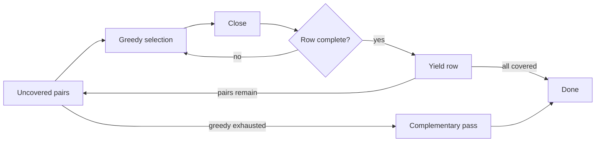

# Algorithm: AETG vs IPOG

CoverTable uses a **one-test-at-a-time greedy algorithm**. This was not designed after AETG specifically — it was a natural result of the implementation, which turned out to closely resemble the AETG (Automatic Efficient Test Generator) family.
This page explains the two major families of covering-array algorithms and where CoverTable fits.

## Two Families of Covering-Array Algorithms

Most N-wise test generation tools fall into one of two families:

| | AETG family | IPOG family |
|---|---|---|
| **Strategy** | Build one complete row at a time | Start with a small array and extend it one parameter at a time |
| **Direction** | Horizontal — each iteration adds a row | Vertical — each iteration adds a column |
| **Origin** | Cohen et al., 1997 | Lei & Tai, 2002 |
| **Used by** | CoverTable, AETG, mAETG, ACTS (AETG mode) | ACTS (IPOG mode), Jenny, PICT |

## AETG: One Row at a Time

```
while uncovered pairs remain:
    row = {}
    while row is not complete:
        pick the pair/value that covers the most uncovered combinations
        add it to row
    emit row
    mark covered pairs
```

**Advantages:**
- Conceptually simple — the unit of work is always "build a row"
- Natural fit for constraints — each candidate value can be checked against partial-row constraints before committing
- Streaming-friendly — rows can be yielded as soon as they are complete

**Disadvantages:**
- The greedy scoring (counting how many uncovered pairs each candidate covers) can be expensive for large parameter spaces
- Tie-breaking and pair ordering significantly affect output size

## IPOG: One Parameter at a Time

```
start with all N-way combinations of the first N parameters
for each remaining parameter P:
    for each existing row:
        extend with the value of P that covers the most new pairs
    if uncovered pairs remain:
        add new rows to cover them
```

**Advantages:**
- Efficient for many parameters with few values — the incremental extension avoids rescanning all pairs
- Tends to produce smaller arrays for high-parameter-count inputs

**Disadvantages:**
- Adding a column to existing rows can conflict with constraints already satisfied
- The algorithm must handle "horizontal growth" (new rows) and "vertical growth" (extending rows) separately
- Not naturally streaming — the array is mutated in place across iterations

## How CoverTable Works

CoverTable's generation loop follows the AETG pattern with several enhancements:

### Phase 1: Greedy Pair Selection

The `greedy` criterion scans uncovered pairs and selects the one that would **remove the most entries from the uncovered set** when added to the current row. This is the AETG-style "maximize coverage" heuristic.

The `simple` criterion skips this scoring and picks the first compatible uncovered pair. This is much faster but produces larger output.

The `tolerance` parameter allows the greedy criterion to accept a "good enough" pair early, trading a small increase in output size for significant speedup.

### Phase 2: Close (Backtracking Completion)

After greedy selection fills some factors, the remaining unfilled factors are completed using **depth-first backtracking**. Values are tried in weight-descending order. At each step, constraint feasibility is checked via `storableCheck` and `forwardCheck`.

This is where CoverTable diverges most from classic AETG: rather than greedily selecting every value, it lets the backtracking solver find a valid completion. This ensures constraint satisfaction without sacrificing coverage.

### Complementary Pass

After the main loop, some pairs may remain uncovered — for example, pairs that were incompatible with every row the greedy phase constructed. These leftover pairs are each set as the starting point of a new row, which is then completed via close. This ensures maximum coverage even when the greedy heuristic misses edge cases.



## Why CoverTable Resembles AETG

CoverTable's algorithm was not modeled after AETG, but the row-by-row greedy approach turned out to be a natural fit for several reasons:

1. **Constraint integration** — Three-valued evaluation and forward checking fit naturally into row-by-row construction. Each candidate pair is validated against the partial row before committing. IPOG's column extension would require re-validating entire rows after each extension.

2. **Streaming output** — `makeAsync()` yields rows as they are completed. IPOG mutates existing rows when extending columns, making incremental output difficult.

3. **Simplicity** — The "build one row, yield it, repeat" loop is straightforward to implement, test, and debug across both Python and TypeScript.

4. **Deterministic ordering** — CoverTable's hash-based pair sorter produces deterministic output without a global RNG. IPOG's column-extension order is inherently tied to parameter declaration order, making it harder to control output variation via a simple salt.

## Trade-offs in Practice

| Scenario | AETG (CoverTable) | IPOG |
|---|---|---|
| Few parameters, many values (e.g. 10^20) | Greedy scoring is fast; good output size | Column extension adds many new rows |
| Many parameters, few values (e.g. 2^100) | Greedy scoring is expensive (many pairs) — use `simple` or `tolerance` | Incremental extension is efficient |
| Complex constraints | Forward checking prunes candidates during row construction | Must validate after column extension; may need row replacement |
| Streaming / progress reporting | Natural — yield per row | Difficult — rows are mutated across iterations |

:::tip
For large parameter spaces where `greedy` is slow, use the `simple` criterion or set a positive `tolerance` to trade output size for speed.
:::
